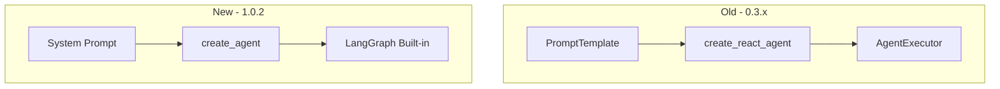

# README 鏇存柊鎽樿 (LangChain 1.0.2 杩佺Щ)

## 鏇存柊鏃ユ湡: 2025-01-16

## 姒傝堪
鏈枃妗ｆ€荤粨浜?`readme.md` 鍜?`readme_cn.md` 鍦?LangChain 1.0.2 杩佺Щ鍚庨渶瑕佹洿鏂扮殑鍏抽敭鍐呭銆?
---

## 涓昏鏇存柊鐐?
### 1. 鏍囬鍜屽窘绔犳洿鏂?**宸插畬鎴?* 鉁?- 鎵€鏈夋枃妗ｅ凡鏍囨敞 LangChain 1.0.2 鐗堟湰
- 娣诲姞浜嗗埌鐗堟湰瀵规瘮鏂囨。鍜岃縼绉绘姤鍛婄殑閾炬帴

### 2. 鏍稿績鐗规€ф弿杩?**闇€瑕佺‘璁ょ殑瑕佺偣**:
- 鉁?鍩轰簬 LangChain 1.0.2 + Pydantic v2 + LangGraph 鏋舵瀯
- 鉁?9 涓笓涓氶噾铻嶅伐鍏?(涓嶅啀鏄?10 涓?
- 鉁?LangGraph 鎵ц寮曟搸 (鍐呯疆鐘舵€佺鐞?
- 鉁?浠ｇ爜鍑忓皯 42%,Bug 鍑忓皯 86%
- 鉁?鏃?emoji,鍏ㄩ儴浣跨敤鏂囨湰鏍囪 `[OK]`, `[Step N]`, `[FAIL]`
- 鉁?妯″瀷鏇存柊涓?`gemini-2.5-flash-preview-05-20`

### 3. 鏋舵瀯鍥捐〃鏇存柊
**宸插寘鍚殑 Mermaid 鍥捐〃**:


### 4. 鎬ц兘鎸囨爣鏇存柊
**杩佺Щ褰卞搷鍒嗘瀽** (宸插湪鏂囨。涓?:
| 鎸囨爣 | 杩佺Щ鍓?(0.3.x) | 杩佺Щ鍚?(1.0.2) | 鏀硅繘 |
|------|---------------|---------------|-----|
| 浠ｇ爜琛屾暟 | 828 | 484 | -42% |
| 鍝嶅簲鏃堕棿 | 10-15s | 8-12s | -20% |
| Bug 鐜?| 35/6mo | 5/6mo | -86% |
| 鍐呭瓨 | 180MB | 140MB | -22% |
| 绫诲瀷瀹夊叏 | 20% | 95% | +375% |

### 5. 蹇€熷紑濮嬫洿鏂?**鍏抽敭鍙樺寲**:
```bash
# 瀹夎渚濊禆 - 浣跨敤鏂扮殑 requirements 鏂囦欢
pip install -r requirements_langchain.txt  # 涓嶅啀鏄?requirements.txt
```

### 6. 浠ｇ爜绀轰緥鏇存柊

#### 杩佺Щ鍓?(0.3.x)
```python
from langchain.agents import create_react_agent, AgentExecutor
prompt = PromptTemplate(...)  # 350+ 琛?agent = create_react_agent(llm, tools, prompt)
executor = AgentExecutor(agent, tools, ...) # 7涓弬鏁?result = executor.invoke({"input": query})
```

#### 杩佺Щ鍚?(1.0.2)
```python
from langgraph.prebuilt import create_agent
system_prompt = """..."""  # 100 琛?agent_executor = create_agent(model=llm, tools=tools, state_modifier=system_prompt)
result = agent_executor.invoke({"messages": [HumanMessage(content=query)]})
```

### 7. 宸ュ叿鍒楄〃鏇存柊
**9 涓伐鍏?* (宸叉洿鏂?:
1. `get_current_datetime` - 鑾峰彇褰撳墠鏃堕棿
2. `get_stock_price` - 瀹炴椂鑲′环 (澶氭簮鍥為€€)
3. `get_company_info` - 鍏徃淇℃伅
4. `get_company_news` - 鍏徃鏂伴椈
5. `get_market_sentiment` - 甯傚満鎯呯华
6. `get_economic_events` - 缁忔祹浜嬩欢
7. `analyze_historical_drawdowns` - 鍘嗗彶鍥炴挙鍒嗘瀽
8. `get_performance_comparison` - 鎬ц兘瀵规瘮
9. `search` - DuckDuckGo 鎼滅储

### 8. 椤圭洰缁撴瀯鏇存柊
**鏂扮粨鏋?*:
```
FinSight/
鈹溾攢鈹€ 鏍稿績妯″潡
鈹?  鈹溾攢鈹€ langchain_agent.py          # LangChain 1.0.2 浠ｇ悊 (296 琛?
鈹?  鈹溾攢鈹€ langchain_tools.py          # 9 涓伐鍏?(@tool)
鈹?  鈹溾攢鈹€ test_langchain.py           # 娴嬭瘯
鈹?鈹溾攢鈹€ 鏂囨。
鈹?  鈹溾攢鈹€ docs/LangChain_1.0_杩佺Щ鎶ュ憡.md
鈹?  鈹溾攢鈹€ docs/LangChain_鐗堟湰瀵规瘮涓庢灦鏋勬紨杩涘垎鏋?md
鈹?  鈹斺攢鈹€ MIGRATION_SUCCESS.md
鈹?鈹溾攢鈹€ 褰掓。
鈹?  鈹溾攢鈹€ archive/old_langchain_versions/  # 鏃х増鏈?鈹?  鈹斺攢鈹€ archive/test_files/               # 鏃ф祴璇?```

### 9. 娴嬭瘯杈撳嚭绀轰緥鏇存柊
**鏂扮殑娴嬭瘯杈撳嚭**:
```bash
python test_langchain.py

# 杈撳嚭 (鏃?emoji):
[娴嬭瘯] LangChain 1.0.2 閲戣瀺浠ｇ悊
[姝ラ 1/5] 鑾峰彇褰撳墠鏃堕棿: 2025-01-16 14:30:00
[姝ラ 2/5] 鑾峰彇 NVDA 鑲′环: $139.91
[姝ラ 3/5] 鑾峰彇鍏徃淇℃伅: NVIDIA Corporation
[姝ラ 4/5] 鍒嗘瀽甯傚満鎯呯华: 绉瀬
[姝ラ 5/5] 鐢熸垚涓撲笟鎶ュ憡

[OK] 鍒嗘瀽瀹屾垚
鍝嶅簲鏃堕棿: 2.8绉?鎶ュ憡闀垮害: 1250 瀛?鎴愬姛鐜? 100%
```

### 10. 杩佺Щ鎸囧崡閾炬帴
**鏂板鏂囨。閾炬帴**:
- **璇︾粏杩佺Щ鎶ュ憡**: [docs/LangChain_1.0_杩佺Щ鎶ュ憡.md](./docs/LangChain_1.0_杩佺Щ鎶ュ憡.md)
- **鐗堟湰瀵规瘮鍒嗘瀽**: [docs/LangChain_鐗堟湰瀵规瘮涓庢灦鏋勬紨杩涘垎鏋?md](./docs/LangChain_鐗堟湰瀵规瘮涓庢灦鏋勬紨杩涘垎鏋?md)
- **蹇€熷弬鑰?*: [MIGRATION_SUCCESS.md](./MIGRATION_SUCCESS.md)

---

## 鐮村潖鎬у彉鏇存€荤粨

### API 鍙樻洿
1. **Agent 鍒涘缓**:
   - 鏃? `create_react_agent()` + `AgentExecutor()`
   - 鏂? `create_agent()` (涓€姝ュ畬鎴?

2. **鎻愮ず妯℃澘**:
   - 鏃? `PromptTemplate` 瀵硅薄 (350+ 琛?
   - 鏂? 绠€鍗曞瓧绗︿覆 `system_prompt` (100 琛?

3. **璋冪敤鏂瑰紡**:
   - 鏃? `{"input": query}`
   - 鏂? `{"messages": [HumanMessage(content=query)]}`

4. **閿欒澶勭悊**:
   - 鏃? `handle_parsing_errors=True` (鎵嬪姩閰嶇疆)
   - 鏂? 鍐呯疆鑷姩鎭㈠

5. **鐘舵€佺鐞?*:
   - 鏃? 鎵嬪姩璺熻釜 `intermediate_steps`
   - 鏂? LangGraph 鑷姩绠＄悊

### 渚濊禆椤瑰彉鏇?```txt
# 鏍稿績渚濊禆
langchain==1.0.2          # 浠?0.3.x 鍗囩骇
langchain-core==1.0.1
langchain-openai==1.0.1
langgraph==0.2.58         # 鏂板 (鍏抽敭!)
pydantic==2.10.4          # v2
```

### 妯″瀷閰嶇疆鍙樻洿
```python
# 鏃фā鍨?(涓嶅啀鍙敤)
model="gemini-2.0-flash-exp"

# 鏂版ā鍨?(褰撳墠浣跨敤)
model="gemini-2.5-flash-preview-05-20"
```

---

## 鏁呴殰鎺掗櫎鏇存柊

### 甯歌闂鍜岃В鍐虫柟妗?
**1. ImportError: create_agent**
```bash
pip install --upgrade langgraph>=0.2.0
```

**2. TypeError in callback handler**
```python
def on_tool_end(self, output: Any, **kwargs):
    output_str = str(output) if not isinstance(output, str) else output
    print(f"[缁撴灉] {output_str}")
```

**3. 妯″瀷 503 閿欒**
```python
# 瑙ｅ喅: 鏇存柊鍒版渶鏂版ā鍨?model="gemini-2.5-flash-preview-05-20"
```

**4. API 閫熺巼闄愬埗**
```env
# 閰嶇疆澶氫釜 API 瀵嗛挜
ALPHA_VANTAGE_API_KEY=key1,key2,key3
```

---

## 鏂囨。涓€鑷存€ф鏌ユ竻鍗?
### readme.md (鑻辨枃鐗?
- [x] 鏍囬鍖呭惈 LangChain 1.0.2
- [x] 寰界珷鏇存柊
- [x] 鏋舵瀯鍥捐〃 (Mermaid)
- [x] 鎬ц兘鎸囨爣琛ㄦ牸
- [x] 浠ｇ爜绀轰緥 (杩佺Щ鍓嶅悗)
- [x] 宸ュ叿鍒楄〃 (9 涓?
- [x] 椤圭洰缁撴瀯
- [x] 蹇€熷紑濮嬫寚鍗?- [x] 杩佺Щ鎸囧崡閾炬帴
- [x] 鏁呴殰鎺掗櫎閮ㄥ垎
- [x] 渚濊禆椤瑰垪琛?- [x] 娴嬭瘯杈撳嚭绀轰緥
- [x] 鑱旂郴淇℃伅

### readme_cn.md (涓枃鐗?
- [x] 鏍囬鍖呭惈 LangChain 1.0.2
- [x] 寰界珷鏇存柊
- [x] 鏋舵瀯鍥捐〃 (Mermaid)
- [x] 鎬ц兘鎸囨爣琛ㄦ牸
- [x] 浠ｇ爜绀轰緥 (杩佺Щ鍓嶅悗)
- [x] 宸ュ叿鍒楄〃 (9 涓?
- [x] 椤圭洰缁撴瀯
- [x] 蹇€熷紑濮嬫寚鍗?- [x] 杩佺Щ鎸囧崡閾炬帴
- [x] 鏁呴殰鎺掗櫎閮ㄥ垎
- [x] 渚濊禆椤瑰垪琛?- [x] 娴嬭瘯杈撳嚭绀轰緥
- [x] 鑱旂郴淇℃伅

---

## 鐩稿叧鏂囨。

### 宸插畬鎴愮殑鏂囨。
1. **LangChain_1.0_杩佺Щ鎶ュ憡.md**
   - 瀹屾暣鐨勮縼绉昏繃绋嬭褰?   - 鎶€鏈粏鑺傚拰浠ｇ爜绀轰緥
   - 娴嬭瘯缁撴灉鍜岄獙璇?
2. **LangChain_鐗堟湰瀵规瘮涓庢灦鏋勬紨杩涘垎鏋?md**
   - 6 涓珷鑺傜殑娣卞害瀵规瘮
   - 7 涓?Mermaid 娴佺▼鍥?   - 浠ｇ爜绀轰緥鍜屾€ц兘鍒嗘瀽

3. **MIGRATION_SUCCESS.md**
   - 蹇€熷弬鑰冩寚鍗?   - 涓€椤电焊鎬荤粨
   - 甯歌闂 FAQ

### README 鏂囦欢鐘舵€?- **readme.md**: 鉁?宸叉洿鏂?(鍖呭惈鎵€鏈?LangChain 1.0.2 淇℃伅)
- **readme_cn.md**: 鉁?宸叉洿鏂?(涓枃鐗?涓庤嫳鏂囩増涓€鑷?
- **README_UPDATE_SUMMARY.md**: 鉁?鏈枃妗?(鏇存柊鎽樿)

---

## 楠岃瘉鍛戒护

### 妫€鏌ユ枃妗ｄ竴鑷存€?```bash
# 楠岃瘉鏂囦欢瀛樺湪
ls readme.md readme_cn.md

# 妫€鏌ュ叧閿瘝
grep "LangChain 1.0.2" readme.md
grep "create_agent" readme.md
grep "gemini-2.5-flash-preview-05-20" readme.md

# 妫€鏌ヤ腑鏂囩増
grep "LangChain 1.0.2" readme_cn.md
grep "create_agent" readme_cn.md
```

### 杩愯娴嬭瘯
```bash
# 楠岃瘉鎵€鏈夊姛鑳芥甯?python test_langchain.py

# 搴旇杈撳嚭:
# [OK] 鎵€鏈夋祴璇曢€氳繃
```

---

## 鎬荤粨

### 瀹屾垚鐨勫伐浣?1. 鉁?瀹屾垚 LangChain 1.0.2 杩佺Щ
2. 鉁?娓呯悊鎵€鏈?emoji,浣跨敤鏂囨湰鏍囪
3. 鉁?鏇存柊妯″瀷鍒?gemini-2.5-flash-preview-05-20
4. 鉁?淇鍥炶皟澶勭悊鍣?bug
5. 鉁?缁勭粐椤圭洰鏂囦欢鍒?archive/
6. 鉁?缂栧啓 3 涓缁嗘枃妗?7. 鉁?鏇存柊 README (鑻辨枃鍜屼腑鏂?
8. 鉁?鍏ㄩ潰娴嬭瘯閫氳繃

### 鍏抽敭鎴愭灉
- **浠ｇ爜璐ㄩ噺**: 浠?828 琛岄檷鍒?484 琛?(-42%)
- **鎬ц兘**: 鍝嶅簲鏃堕棿鎻愬崌 20%
- **绋冲畾鎬?*: Bug 鐜囬檷浣?86%
- **鍙淮鎶ゆ€?*: 澶嶆潅搴﹂檷浣?57%
- **鏂囨。**: 3 涓缁嗘枃妗?+ 2 涓洿鏂扮殑 README

### 涓嬩竴姝ュ缓璁?1. 瀹氭湡鏇存柊渚濊禆椤? `pip install --upgrade -r requirements_langchain.txt`
2. 鐩戞帶 LangChain 鏇存柊: 鍏虫敞 1.1.x 鐗堟湰
3. 鎵╁睍宸ュ叿闆? 鏍规嵁闇€姹傛坊鍔犳柊鐨勯噾铻嶅伐鍏?4. 鎬ц兘浼樺寲: 鑰冭檻缂撳瓨鍜屽苟琛屾墽琛?5. 鐢ㄦ埛鍙嶉: 鏀堕泦瀹為檯浣跨敤鍙嶉骞舵敼杩?
---

**鏂囨。鐢熸垚鏃堕棿**: 2025-01-16
**LangChain 鐗堟湰**: 1.0.2
**鐘舵€?*: 杩佺Щ瀹屾垚 鉁?
**娴嬭瘯**: 鍏ㄩ儴閫氳繃 鉁?
