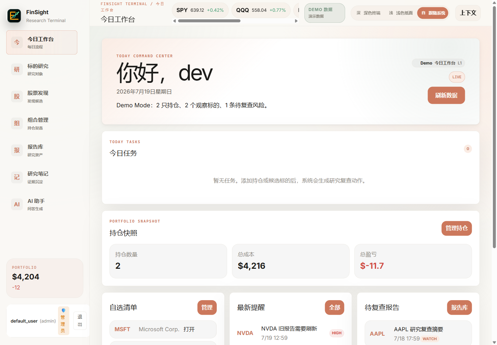
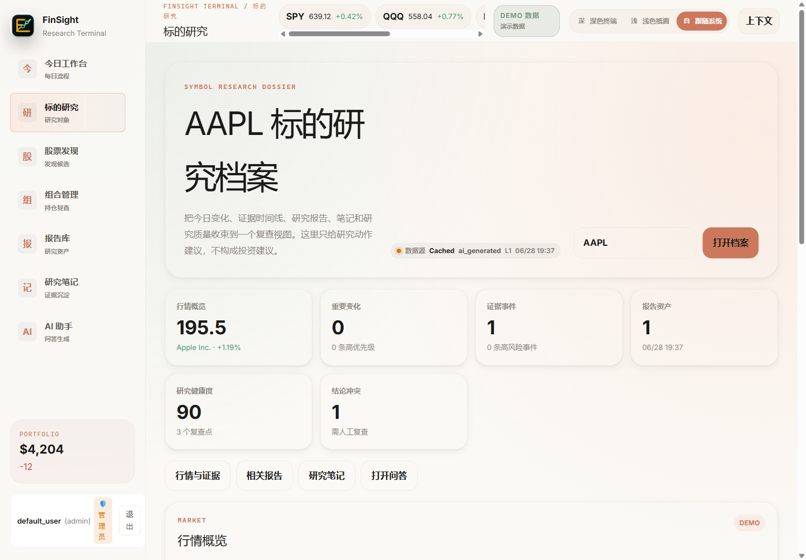
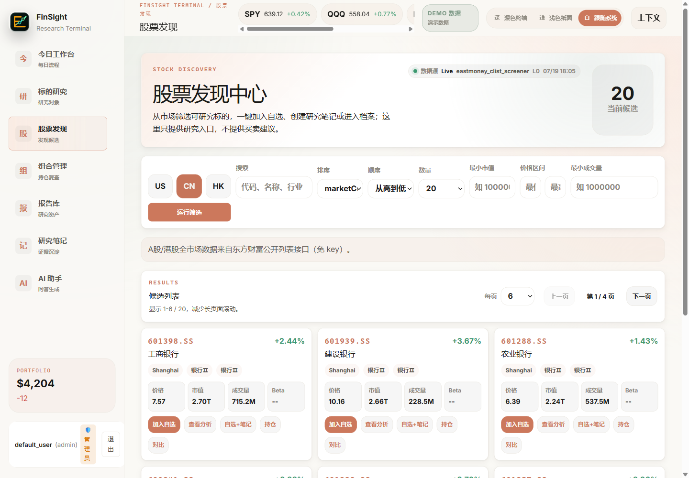
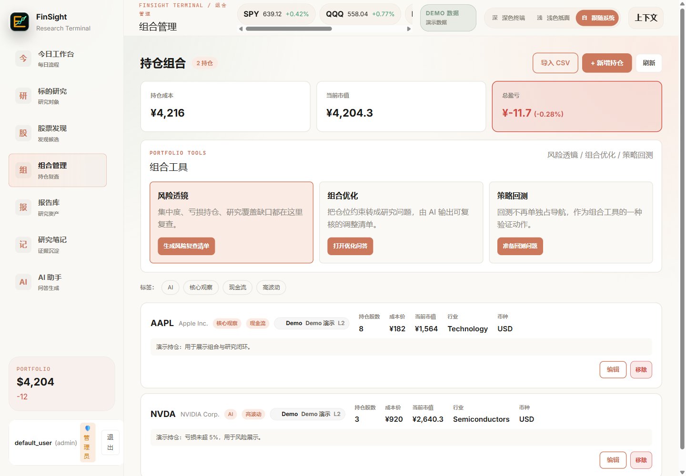
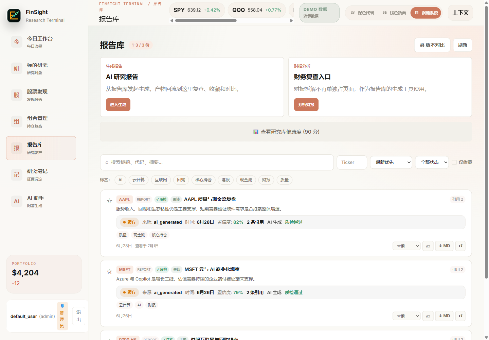
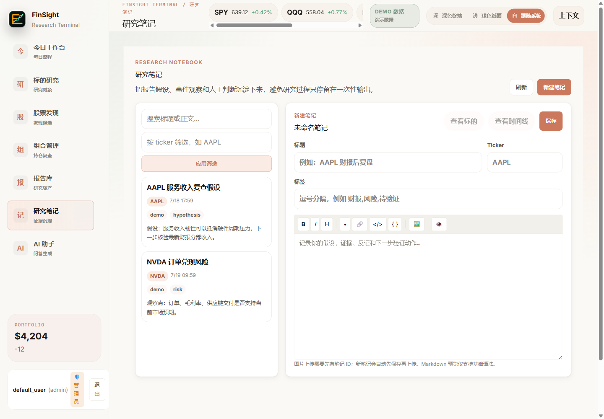
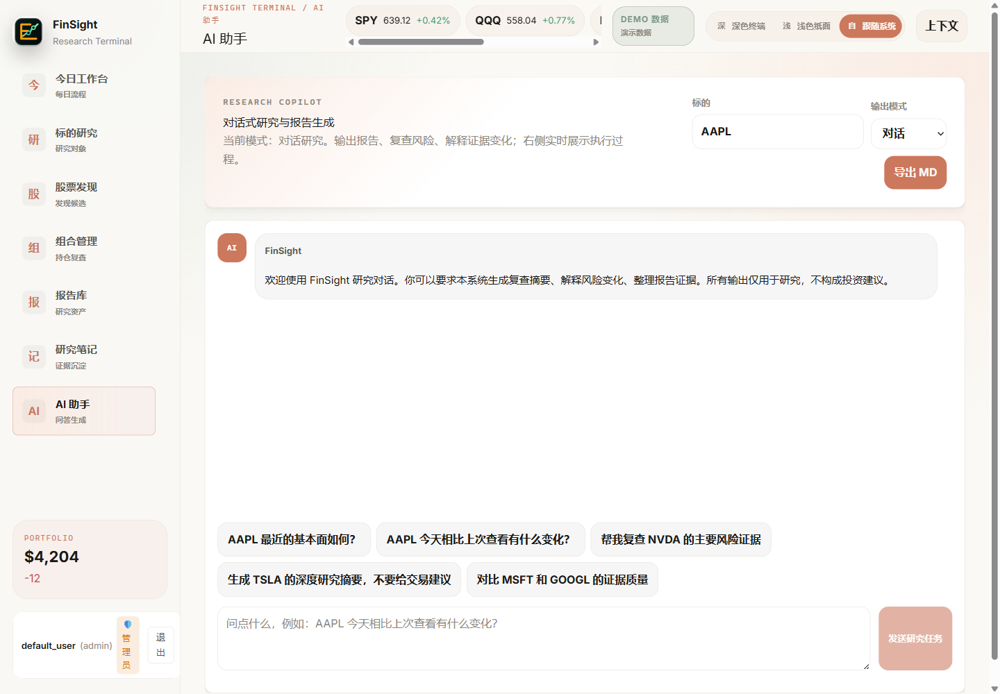

# FinSight AI

[English](./README.md)

FinSight AI 是一个基于 **Vue 3 + FastAPI** 的证据驱动金融研究工作台。它不是交易顾问，不输出买入、卖出、持有、目标价或仓位指令；它的目标是帮助个人研究者每天回答四个问题：

- 今天发生了什么变化？
- 这个变化为什么重要？
- 它影响哪个标的、报告、风险项、提醒或研究笔记？
- 下一步应该去哪里复查证据？



> 截图使用明确标注的 Demo Mode 数据，仅用于展示产品界面，不代表实时行情，也不构成投资建议。

## 当前主线

```text
Browser
  -> frontend-vue  (Vue 3 + Vite + ECharts)
  -> backend       (FastAPI + research services + optional LLM/RAG)
  -> local data / Docker PostgreSQL
```

旧 React 前端和 Spring 迁移实验已经退出当前运行链路。

## 最新仓库更新（2026-07-19）

- LangGraph runner 或 checkpointer 未就绪时，内部健康检查会返回 `degraded`，不再出现假绿状态。
- Docker 构建上下文已排除 pytest 临时目录和本地 `tmp/` 产物。
- 本地 Compose 已完成重建验证，`postgres`、`backend`、`frontend` 均为 `healthy`。
- GitHub 展示截图与中英文 README 已同步到当前 7 入口 Vue 工作台。

## 产品导览

| 标的研究档案 | 股票发现 |
| --- | --- |
|  |  |
| 组合管理 | 报告库 |
|  |  |
| 研究笔记 | AI 研究助手 |
|  |  |

## 核心能力

- **Today Workspace**：每日研究入口，聚合持仓、自选、提醒、待复查报告、重要变化和下一步动作。
- **Stock Discovery**：股票发现入口，支持筛选、加入自选、导入持仓记录、创建初始研究笔记、进入标的档案。
- **Dashboard**：高信息密度标的分析页，展示报价、K 线、财务指标、新闻、AI 洞察和数据来源标识。
- **Symbol Dossier**：标的研究档案，聚合 What Changed、Timeline、报告、笔记、质量问题和冲突证据。
- **Research Notebook**：Markdown 研究笔记，支持图片上传、ticker 筛选、搜索和软删除。
- **Evidence Timeline**：统一事件流，聚合报告、提醒、笔记、风险和自选变化。
- **What Changed**：规则化识别今日重要变化，并给出原因和复查路径。
- **Research Quality**：研究库健康度、过期报告、低引用、未复查和被新证据挑战的旧结论。
- **Data Source Status**：显示 US/CN/HK、LLM、RAG、Auth 当前是 Live、Fallback、Demo 还是缺少配置。

## 本地启动

### 后端

```powershell
python -m venv .venv
.\.venv\Scripts\Activate.ps1
pip install -r requirements.txt
python -m uvicorn backend.api.main:app --reload --host 127.0.0.1 --port 8000
```

### 前端

```powershell
cd frontend-vue
npm install
npm run dev
```

打开终端输出的 Vite 地址即可。开发环境下前端默认连接 `127.0.0.1:8000`。

### Docker Compose

配置 `.env.server` 后，构建并启动完整本地服务：

```powershell
docker compose up -d --build
docker compose ps
```

访问 `http://localhost/`。默认 Compose 仅暴露 nginx 前端的 80 端口，FastAPI 与 PostgreSQL 保持在 Docker 内部网络。

## Demo Mode

没有真实行情、FMP、LLM 或生产密钥时，可以开启 Demo Mode：

```powershell
$env:FINSIGHT_DEMO_MODE="true"
python -m uvicorn backend.api.main:app --reload --host 127.0.0.1 --port 8000
```

Demo Mode 会返回明确标注的演示数据，保证 `/welcome`、`/stocks`、`/dashboard`、`/dossier`、`/portfolio`、`/reports`、`/notes`、`/timeline` 等核心页面可完整展示研究闭环。

状态接口：

```text
GET /api/demo/status
GET /api/data-sources/status
```

## 配置

复制示例配置后填入本地值：

```powershell
Copy-Item .env.example .env
Copy-Item .env.server.example .env.server
```

真实密钥不要提交。生产发布前至少需要：

- `JWT_SECRET`
- `API_AUTH_KEYS`
- 有效的 `OPENAI_COMPATIBLE_API_KEY` 或兼容 LLM 服务密钥

发布阻塞项见 [`docs/RELEASE_READINESS.md`](./docs/RELEASE_READINESS.md)。

## 状态口径

- **本地 Demo 体验**：`READY`。无真实密钥也能查看主要页面和研究闭环。
- **本地真实数据体验**：`READY_WITH_NOTES`。取决于行情、LLM、RAG 等外部服务配置。
- **生产发布**：`READY_WITH_BLOCKERS`。只有真实密钥、有效 LLM key 和最小发布 smoke 都通过后，才升级为 `READY`。

## 验证命令

```powershell
python -m pytest -q
cd frontend-vue
npm run typecheck
npm run build
npm run test:e2e
```

本地发布门禁：

```powershell
python scripts/local_release_gate.py
```

GitHub Actions 会执行前端 lint/build/E2E、后端 pytest、检索与 RAG 质量门禁，以及 Docker smoke 验证。

## 文档入口

- [`docs/DOCS_INDEX.md`](./docs/DOCS_INDEX.md)：文档索引。
- [`docs/API_CONTRACT_CURRENT.md`](./docs/API_CONTRACT_CURRENT.md)：当前 API 契约与 Demo/Live 行为。
- [`docs/PROJECT_TIMELINE.md`](./docs/PROJECT_TIMELINE.md)：证据化项目时间线。
- [`docs/RELEASE_READINESS.md`](./docs/RELEASE_READINESS.md)：发布就绪状态与阻塞项。
- [`docs/DELIVERY_OVERVIEW.md`](./docs/DELIVERY_OVERVIEW.md)：阶段性交付总览。

## 安全边界

- 不输出买入、卖出、持有、目标价、止盈止损、仓位比例或收益承诺。
- What Changed、Risk Lens、Dossier 只提供研究复查路径。
- `.env`、`.env.server`、数据库、上传文件、日志、本地记忆、测试报告和 Playwright 产物默认不进入 Git。

## Git 历史说明

早期开发主要发生在本地工作区和 AI Agent 会话中。当前仓库使用干净本地历史重建，以避免把本地运行数据、个人信息、会话摘要或疑似密钥痕迹带入仓库。真实项目演进通过 [`docs/PROJECT_TIMELINE.md`](./docs/PROJECT_TIMELINE.md) 用“证据来源 + 日期可信度”记录，不伪造 commit 日期。
